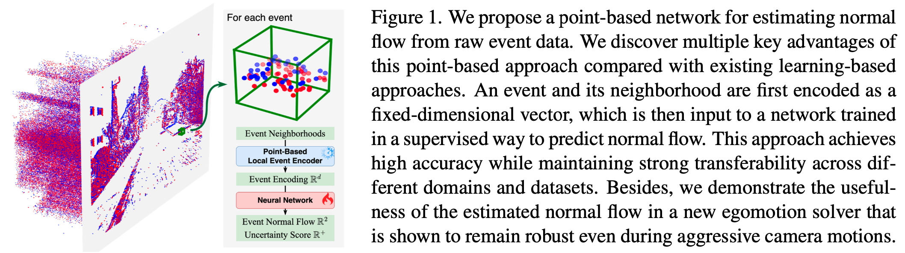
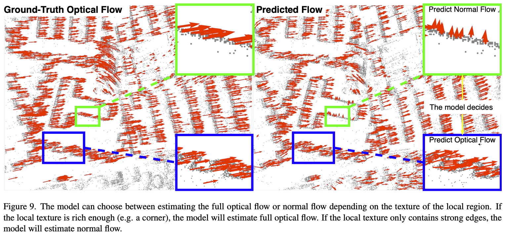
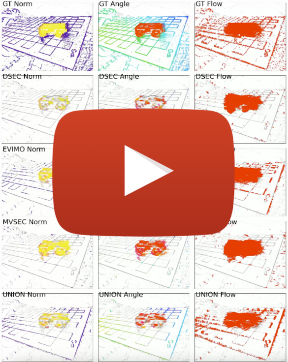

<h1 align='center' style="text-align:center; font-weight:bold; font-size:2.0em;letter-spacing:2.0px;"> Learning Normal Flow Directly from Event Neighborhoods </h1>

<p align='center' style="text-align:center;font-size:1.25em;">
    <a href="https://www.cs.umd.edu/~dhyuan" target="_blank" style="text-decoration: none;">Dehao Yuan</a>&nbsp;&nbsp;
    <a href="https://www.aftersomemath.com" target="_blank" style="text-decoration: none;">Levi Burner</a>&nbsp;&nbsp;
    <a href="https://jiayi-wu-leo.github.io" target="_blank" style="text-decoration: none;">Jiayi Wu</a>&nbsp;&nbsp;
    <a href="https://scholar.google.com/citations?user=UKAsIsUAAAAJ&hl=en" target="_blank" style="text-decoration: none;">Minghui Liu</a>&nbsp;&nbsp;
    <a href="https://codingrex.github.io" target="_blank" style="text-decoration: none;">Jingxi Chen</a>&nbsp;&nbsp;
    <a href="http://users.umiacs.umd.edu/~yiannis/" target="_blank" style="text-decoration: none;">Yiannis Aloimonos</a>&nbsp;&nbsp;
    <a href="http://users.umiacs.umd.edu/~fer/" target="_blank" style="text-decoration: none;">Cornelia Fermüller</a>
    <br><br>
    <a href="https://prg.cs.umd.edu" target="_blank" style="text-decoration: none;">Perception and Robotics Group at University of Maryland</a>
    <br><br>
    <a href="https://arxiv.org/abs/2412.11284" target="_blank" style="text-decoration: none;">[Paper]</a> &nbsp;&nbsp
    <a href="https://drive.google.com/drive/folders/1gkmUyZX5VRf8DxiBKL9CSdWdifjqZVq3?usp=sharing" target="_blank" style="text-decoration: none;">[Flow Prediction Videos (34 scenes)]</a>
</p>

## Abstract
<div align="center">

</div>

<div align="center">

</div>

## API Usage
It is a generic normal flow estimator with event camera inputs. The API is easily used by following codes, after [installing the package](#installation). See [demo](./demo/) for the codes and data for running the demo:
```
cd demo
python main.py
```
The API call is as simple as followed:
``` python
from VecKM_flow.inference import VecKMNormalFlowEstimator
from VecKM_flow.visualize import gen_flow_video

estimator = VecKMNormalFlowEstimator()
flow_predictions, flow_uncertainty = estimator.inference(events_t, undistorted_events_xy)
flow_predictions[flow_uncertainty > 0.3] = np.nan

gen_flow_video(
    events_t.numpy(), 
    undistorted_events_xy.numpy(), 
    flow_predictions.numpy(), 
    './frames', './output.mp4', fps=30)
```

The data dimensions are as followed:
| Variables        | Description | Data Dimension  |
|-------------|-----|-------------|
| `events_t`  | Sorted event time in seconds | `(n, )` float64    |
| `undistorted_events_xy` | Undistorted normalized event coordinates (focal length one). The range shall be around (-1, 1). See [Undistorted Normalized Coordinates](#undistorted-normalized-coordinates) for computing them. 1st row is width, 2nd row is height.  | `(n, 2)` float32      |
| `flow_predictions` | Predicted normal flow. Unit: undistorted normalized pixels per second. | `(n, 2)` float32      |
| `flow_uncertainty` | Prediction uncertainty. | `(n, )` float32 >= 0 |

The prediction is visualized as a video like this:
<div align="center">

</div>

#### Training Set Options
We provide four estimators, which can be selected by the parameter `training_set`. The four possible parameters are `"UNION"`, `"MVSEC"`, `"DSEC"`, `"EVIMO"`, which state the training set that the estimator is trained on. `"UNION"` is the model that trained on the union of the three datasets. Therefore, it is generally recommended to use `training_set="UNION"`, which is set as default.
``` python
estimator = VecKMNormalFlowEstimator(training_set="UNION")  # default model
```

## Installation
```
git clone https://github.com/dhyuan99/VecKM_flow.git
cd VecKM_flow

conda create -n VecKM_flow python=3.13
conda activate VecKM_flow

pip install --upgrade pip setuptools wheel
python setup.py sdist bdist_wheel
pip install .
```
If you encounter any issues installing, please raise an issue.

## Undistorted Normalized Coordinates
To obtain the undistorted normalized coordinates, one needs to utilize `cv2.undistortPoints` and obtain the intrinsic camera matrix `K` and distortion coefficient `D` from the dataset.
``` python
def get_undistorted_events_xy(raw_events_xy, K, D):
    # raw_events_xy has shape (n, 2). The range is e.g. (0, 640) int X (0, 480) int.
    raw_events_xy = raw_events_xy.astype(np.float32)
    undistorted_normalized_xy = cv2.undistortPoints(raw_events_xy.reshape(-1, 1, 2), K, D)
    undistorted_normalized_xy = undistorted_normalized_xy.reshape(-1, 2)
    return undistorted_normalized_xy
```

## Evaluated Datasets
**[Recommend to Watch]** We evaluated the estimator on [MVSEC](https://daniilidis-group.github.io/mvsec/), [DSEC](https://dsec.ifi.uzh.ch), [EVIMO](https://better-flow.github.io/evimo/download_evimo_2.html). The flow prediction videos of every evaluated scene (in total 34 scenes) can be found here: 

<div align="center">
    <a href="https://drive.google.com/drive/folders/1gkmUyZX5VRf8DxiBKL9CSdWdifjqZVq3?usp=sharing" target="_blank">
    
    </a>
</div>

**[Reproduce the inference]** We precompute the undistorted normalized coordinates. They can be downloaded in [this drive](https://drive.google.com/drive/folders/1M7vaokRF71f91AtWBaQuZlSvOiTSePox?usp=sharing). The data format is exactly the same as the [demo data](demo/demo_data). Therefore, it is straight-forward to use the API to inference the datasets.

## Egomotion Estimation
We propose an SVM-based egomotion estimator in the paper. The estimator uses predicted normal flow and IMU rotational measurement to predict the translation direction. The implementation is in [`./egomotion`](./egomotion).

<div align="center">

</div>

## Citations
If you find this helpful, please consider citing
```
```

This project is an extension project from [VecKM](https://github.com/dhyuan99/VecKM), an ICML2024 paper.
```
@InProceedings{pmlr-v235-yuan24b,
  title = 	 {A Linear Time and Space Local Point Cloud Geometry Encoder via Vectorized Kernel Mixture ({V}ec{KM})},
  author =       {Yuan, Dehao and Fermuller, Cornelia and Rabbani, Tahseen and Huang, Furong and Aloimonos, Yiannis},
  booktitle = 	 {Proceedings of the 41st International Conference on Machine Learning},
  pages = 	 {57871--57886},
  year = 	 {2024},
  editor = 	 {Salakhutdinov, Ruslan and Kolter, Zico and Heller, Katherine and Weller, Adrian and Oliver, Nuria and Scarlett, Jonathan and Berkenkamp, Felix},
  volume = 	 {235},
  series = 	 {Proceedings of Machine Learning Research},
  month = 	 {21--27 Jul},
  publisher =    {PMLR},
  pdf = 	 {https://raw.githubusercontent.com/mlresearch/v235/main/assets/yuan24b/yuan24b.pdf},
  url = 	 {https://proceedings.mlr.press/v235/yuan24b.html},
}
```
